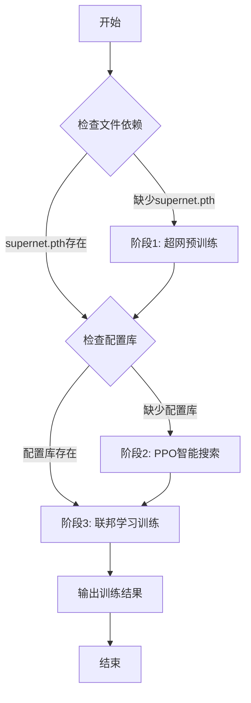

# SmartFL: 智能三阶段联邦学习框架

## 概述

联邦学习（FL）的一个核心挑战是如何有效处理大量具有不同计算和存储能力的（即"异构"的）客户端设备。标准联邦学习为所有设备使用相同大小的模型，这会导致"掉队者效应"——系统整体效率受限于最慢的设备。

**SmartFL** 是一个先进的联邦学习框架，现已升级为智能三阶段流水线。它实现了完整的**端到端自动化流程**：从超网预训练到PPO智能架构搜索，再到分层联邦学习训练。框架会根据客户端的资源约束，**实时地、动态地**为每个参与的客户端生成一个"量身定制"的、具有最优宽度和深度的子网络，显著提升整个联邦网络的训练效率和模型性能。

## 🚀 核心特性

### 智能三阶段流水线
- **阶段1：超网预训练** - 自动训练大型超网获得高质量预训练权重
- **阶段2：PPO智能架构搜索** - 使用强化学习替代暴力搜索，智能生成架构配置库
- **阶段3：分层联邦学习** - 基于智能配置库进行资源感知的联邦训练

### 先进技术特性  
- **PPO强化学习架构搜索**: 使用近端策略优化算法，以核范数最大化+多样性探索为目标，智能生成高质量架构
- **动态在线架构选择**: 在每轮训练开始时，根据客户端资源约束动态选择最优架构组合
- **混合模型缩放**: 同时支持**垂直缩放**（调整宽度）和**水平缩放**（早退出口调整深度）
- **多出口知识蒸馏**: 采用先进训练策略，让浅层出口学习深层行为，提升小模型性能
- **智能依赖管理**: 自动检测文件依赖，支持阶段跳过和增量执行

### 系统优势
- 🎯 **一键执行**: 单个命令完成全流程自动化
- ⚡ **效率大幅提升**: PPO智能搜索相比暴力遍历速度和质量显著提升  
- 🧠 **参数统一管理**: 所有三阶段参数通过命令行集中控制
- 🛡️ **智能错误处理**: 完善的依赖检查和阶段控制机制

## 🛠️ 使用方法

### 快速开始

**完整三阶段自动执行**（推荐新用户）：
```bash
python main.py --arch resnet110_4 --data cifar100 --num_clients 100 --num_rounds 400
# 自动执行: 超网训练 → PPO配置生成 → 联邦学习
```

**使用GPU加速**（推荐）：
```bash
python main.py --arch resnet110_4 --data cifar100 --num_clients 100 --num_rounds 400 \
    --use_gpu 1 --gpu_idx 0 \
    --supernet_epochs 200 --num_architectures 1000
```

### 阶段控制

**跳过已完成阶段**：
```bash
# 如果已有超网文件，跳过阶段1
python main.py --skip_stage1 --arch resnet110_4 --num_clients 100 --num_rounds 200

# 如果已有配置库文件，跳过前两个阶段  
python main.py --skip_stage1 --skip_stage2 --arch resnet110_4 --num_clients 100 --num_rounds 200
```

**只执行特定阶段**：
```bash
# 只训练超网
python main.py --stages_only "1" --data cifar100 --supernet_epochs 300

# 只生成架构配置库
python main.py --stages_only "2" --num_architectures 2000 --episodes_per_batch 200

# 只运行联邦学习
python main.py --stages_only "3" --arch resnet110_4 --num_clients 200 --num_rounds 500
```

### 自定义参数配置

**高性能配置**（用于研究/生产环境）：
```bash
python main.py --arch resnet110_4 --data cifar100 \
    --supernet_epochs 500 --supernet_lr 0.1 \
    --num_architectures 2000 --episodes_per_batch 300 --ppo_learning_rate 0.001 \
    --num_clients 200 --num_rounds 1000 \
    --flops_constraints 50.0 100.0 150.0 300.0 \
    --params_constraints 0.5 0.8 1.2 2.0 \
    --client_split_ratios 0.3 0.3 0.2 0.2 \
    --use_gpu 1 --gpu_idx 0 --save_path outputs/high_performance_run
```

**快速测试配置**（用于调试/验证）：
```bash
python main.py --arch resnet110_4 --data cifar100 \
    --supernet_epochs 5 \
    --num_architectures 50 --episodes_per_batch 20 \
    --num_clients 20 --num_rounds 10 \
    --use_gpu 0 --save_path outputs/quick_test
```

**增量配置生成**（扩展现有配置库）：
```bash
python main.py --stages_only "2" \
    --num_architectures 5000 --episodes_per_batch 500 \
    --config_library_path extended_ppo_library.json
```

### 实际应用场景

#### 场景1：首次完整部署
```bash
# 适用于第一次部署SmartFL系统
python main.py --arch resnet110_4 --data cifar100 \
    --supernet_epochs 200 \
    --num_architectures 1000 --episodes_per_batch 150 \
    --num_clients 100 --num_rounds 400 \
    --flops_constraints 80.0 120.0 160.0 250.0 \
    --use_gpu 1 --save_path outputs/production_deployment
```

#### 场景2：设备资源受限环境
```bash
# 适用于边缘设备或资源受限环境
python main.py --arch resnet110_4 --data cifar100 \
    --supernet_epochs 100 \
    --num_architectures 300 --episodes_per_batch 50 \
    --num_clients 50 --num_rounds 200 \
    --flops_constraints 30.0 60.0 90.0 150.0 \
    --use_gpu 0 --save_path outputs/resource_constrained
```

#### 场景3：大规模联邦学习
```bash
# 适用于大规模联邦学习研究
python main.py --arch resnet110_4 --data cifar100 \
    --supernet_epochs 300 \
    --num_architectures 3000 --episodes_per_batch 400 \
    --num_clients 500 --num_rounds 1000 \
    --flops_constraints 60.0 120.0 200.0 400.0 \
    --client_split_ratios 0.4 0.3 0.2 0.1 \
    --use_gpu 1 --gpu_idx 0 --save_path outputs/large_scale_fl
```

#### 场景4：研究实验对比
```bash
# 生成多种配置库进行对比实验
python main.py --stages_only "2" --num_architectures 1000 \
    --config_library_path configs_baseline.json --episodes_per_batch 100

python main.py --stages_only "2" --num_architectures 1000 \
    --config_library_path configs_enhanced.json --episodes_per_batch 300 --ppo_learning_rate 0.0005

# 使用不同配置库进行联邦学习对比
python main.py --stages_only "3" --config_library_path configs_baseline.json \
    --save_path outputs/baseline_experiment

python main.py --stages_only "3" --config_library_path configs_enhanced.json \
    --save_path outputs/enhanced_experiment
```

#### 场景5：模型评估和部署
```bash
# 训练完成后进行模型评估
python main.py --evalmode global --evaluate_from outputs/production_deployment/model_best.pth.tar

# 评估各个客户端级别的性能
python main.py --evalmode local --evaluate_from outputs/production_deployment/model_best.pth.tar

# 专门用于生产环境的最终配置
python main.py --arch resnet110_4 --data cifar100 \
    --skip_stage1 --skip_stage2 \  # 使用预生成的配置
    --num_clients 1000 --num_rounds 2000 \
    --flops_constraints 100.0 200.0 300.0 500.0 \
    --config_library_path production_configs.json \
    --save_path outputs/production_final
```

### 关键参数说明

#### 阶段控制参数
- `--skip_stage1/2/3`: 跳过指定阶段
- `--stages_only`: 只运行指定阶段（如 "1,2" 或 "3"）

#### 阶段1（超网训练）参数
- `--supernet_epochs`: 训练轮数（默认200，建议100-500）
- `--supernet_lr`: 学习率（默认0.1）
- `--supernet_save_path`: 保存路径（默认supernet.pth）

#### 阶段2（PPO配置生成）参数  
- `--num_architectures`: 生成配置数量（默认500，建议500-5000）
- `--episodes_per_batch`: PPO训练强度（默认100，建议50-500）
- `--config_library_path`: 配置库保存路径

#### 阶段3（联邦学习）参数
- `--num_clients`: 客户端数量（建议50-1000）
- `--num_rounds`: 联邦轮数（建议200-2000）
- `--flops_constraints`: 各级别FLOPs限制（4个值，单位M）
- `--params_constraints`: 各级别参数量限制（可选，4个值，单位M）
- `--client_split_ratios`: 客户端分布比例（4个值，和为1）

## 安装

1.  克隆本仓库。
2.  强烈建议使用Python虚拟环境。
3.  安装核心依赖：
    ```bash
    pip install torch torchvision numpy tqdm
    ```

## 📁 项目结构

```
SmartFL/
├── main.py                          # 🚀 智能三阶段流水线主入口
├── args.py                          # ⚙️ 统一参数管理系统  
├── ppo_architecture_generator.py    # 🧠 PPO强化学习架构搜索引擎
├── hierarchical_model_selector.py   # 🎯 在线动态架构选择算法
├── fed.py                           # 🔗 核心联邦学习逻辑 (Federator类)
├── train.py                         # 📚 客户端本地训练逻辑，包含知识蒸馏
├── predict.py                       # 📊 模型评估和预测功能
├── config.py                        # 📋 模型和训练配置定义
├── models/
│   ├── resnet.py                    # 💎 动态缩放ResNet，支持早退出和分层训练
│   ├── searchable_resnet.py         # 🔍 可搜索ResNet模型定义
│   └── model_utils.py               # 🛠️ 模型工具函数和损失函数
├── utils/
│   ├── metrics.py                   # 📈 FLOPs、核范数等性能指标计算
│   ├── utils.py                     # 🧰 通用工具函数
│   └── grad_traceback.py           # 🔄 梯度回溯和模型缩放工具
├── data_tools/
│   └── dataloader.py               # 📦 数据加载和联邦数据分布工具
├── test_ppo_generator.py            # 🧪 PPO架构生成器测试套件
├── outputs/                         # 📂 实验结果、日志和训练模型存储
├── ppo_architecture_library.json    # 🎯 PPO智能生成的架构配置库
└── brute_force_results.json        # 📋 传统暴力搜索结果（向后兼容）
```

### 🔄 系统工作流

